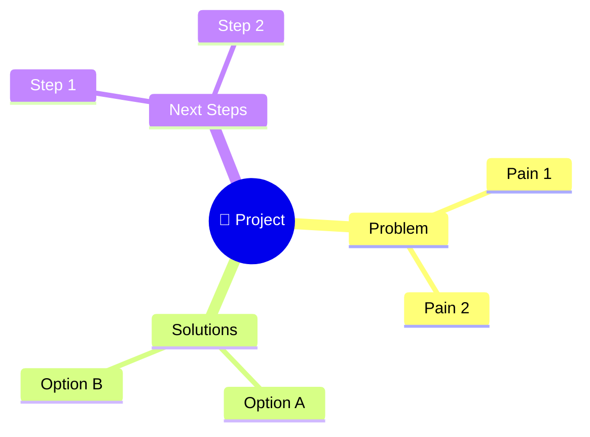
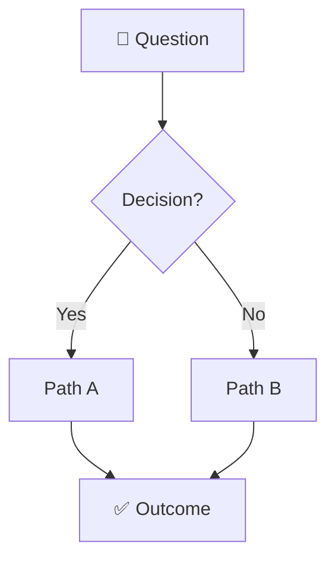
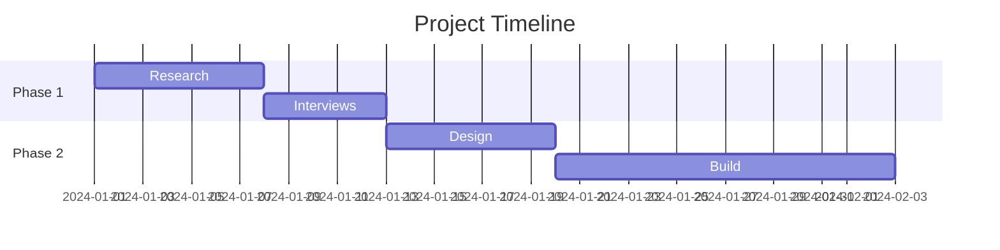
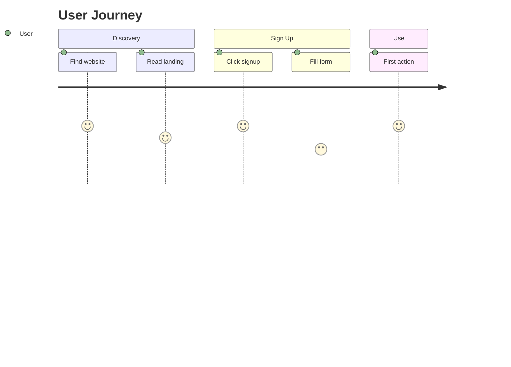
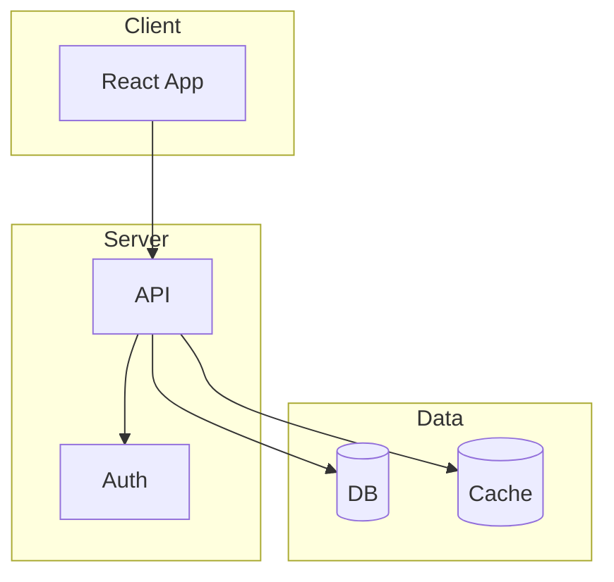

# Visual Output Templates

Templates for visual brainstorming outputs. Each has Mermaid + ASCII fallback.

## When to Use

| Need | Template |
|------|----------|
| Idea hierarchy | Mind Map |
| Decision flow | Flowchart |
| Project phases | Timeline |
| Compare options | Comparison Grid |
| Priorities | Effort/Impact Matrix |
| Tasks | Kanban Board |
| Relationships | Entity Diagram |

---

## Mind Map

### Mermaid Version


### ASCII Fallback
```
                    🎯 Project Name
                          │
        ┌─────────────────┼─────────────────┐
        │                 │                 │
    Problem           Solutions          Next Steps
        │                 │                 │
   ├─ Pain 1         ├─ Option A        ├─ Step 1
   └─ Pain 2         └─ Option B        └─ Step 2
```

---

## Decision Flowchart

### Mermaid Version


### ASCII Fallback
```
    ┌──────────────┐
    │  🤔 Question │
    └──────┬───────┘
           │
    ┌──────▼───────┐
    │  Decision?   │
    └──┬───────┬───┘
       │       │
      Yes      No
       │       │
    ┌──▼──┐ ┌──▼──┐
    │ A   │ │ B   │
    └──┬──┘ └──┬──┘
       │       │
       └───┬───┘
           │
    ┌──────▼───────┐
    │  ✅ Outcome  │
    └──────────────┘
```

---

## Project Timeline

### Mermaid Version


### ASCII Fallback
```
Week    1    2    3    4    5    6
        ├────┼────┼────┼────┼────┤

Phase 1 ████████████
        Research  Interviews

Phase 2              ████████████████████
                     Design    Build

        ──────────────────────────────────▶
```

---

## Effort/Impact Matrix

### Visual Version (HTML)
```html
<div style="display: grid; grid-template-columns: 1fr 1fr; gap: 8px; max-width: 400px;">
  <div style="background: #22c55e; color: white; padding: 16px; border-radius: 8px; text-align: center;">
    ⭐ Quick Wins<br><small>Low Effort / High Impact</small>
  </div>
  <div style="background: #3b82f6; color: white; padding: 16px; border-radius: 8px; text-align: center;">
    🎯 Big Bets<br><small>High Effort / High Impact</small>
  </div>
  <div style="background: #f59e0b; color: white; padding: 16px; border-radius: 8px; text-align: center;">
    🤷 Fill-ins<br><small>Low Effort / Low Impact</small>
  </div>
  <div style="background: #ef4444; color: white; padding: 16px; border-radius: 8px; text-align: center;">
    ❌ Avoid<br><small>High Effort / Low Impact</small>
  </div>
</div>
```

### ASCII Fallback
```
                    Low Effort       High Effort
                ┌───────────────┬───────────────┐
   High Impact  │  ⭐ QUICK WIN │  🎯 BIG BET   │
                │               │               │
                │  • Feature A  │  • Feature C  │
                │  • Feature B  │               │
                ├───────────────┼───────────────┤
   Low Impact   │  🤷 FILL-IN   │  ❌ AVOID     │
                │               │               │
                │  • Feature D  │  • Feature E  │
                │               │               │
                └───────────────┴───────────────┘
```

---

## Kanban Board

### ASCII Version
```
┌─────────────────┬─────────────────┬─────────────────┐
│   📋 TO DO (3)  │  🔄 DOING (1)   │   ✅ DONE (2)   │
├─────────────────┼─────────────────┼─────────────────┤
│                 │                 │                 │
│ ┌─────────────┐ │ ┌─────────────┐ │ ┌─────────────┐ │
│ │ Task 1      │ │ │ Task 4      │ │ │ Task 5      │ │
│ │ [High] 🔴   │ │ │ [Med] 🟡    │ │ │ Done! ✓     │ │
│ └─────────────┘ │ └─────────────┘ │ └─────────────┘ │
│                 │                 │                 │
│ ┌─────────────┐ │                 │ ┌─────────────┐ │
│ │ Task 2      │ │                 │ │ Task 6      │ │
│ │ [Med] 🟡    │ │                 │ │ Done! ✓     │ │
│ └─────────────┘ │                 │ └─────────────┘ │
│                 │                 │                 │
│ ┌─────────────┐ │                 │                 │
│ │ Task 3      │ │                 │                 │
│ │ [Low] 🟢    │ │                 │                 │
│ └─────────────┘ │                 │                 │
│                 │                 │                 │
└─────────────────┴─────────────────┴─────────────────┘
```

---

## Pro/Con Table

### Markdown Version
```markdown
| Option | ✅ Pros | ❌ Cons | Score |
|--------|---------|---------|-------|
| A ⭐   | Fast, familiar | Expensive | 8/10 |
| B      | Cheap | Slow, learning curve | 5/10 |
| C      | Modern | Immature ecosystem | 6/10 |
```

### ASCII Version
```
┌──────────────┬────────────────┬────────────────┬───────┐
│ Option       │ ✅ Pros        │ ❌ Cons        │ Score │
├──────────────┼────────────────┼────────────────┼───────┤
│ A ⭐ Winner  │ Fast, familiar │ Expensive      │ 8/10  │
│ B            │ Cheap          │ Slow           │ 5/10  │
│ C            │ Modern         │ Immature       │ 6/10  │
└──────────────┴────────────────┴────────────────┴───────┘
```

---

## User Journey

### Mermaid Version


### ASCII Version
```
Discovery          Sign Up            Onboarding         Use
────────────────────────────────────────────────────────────▶

  😊 Find site       😐 Fill form       😊 Tutorial       😊 Success!
     ↓                  ↓                  ↓                ↓
  😊 Read landing    😟 Verify email    😊 First action   😊 Daily use
     ↓                  ↓                  ↓
  😊 Click CTA       😐 Wait confirm    😊 "Aha!" moment

Emotion:  5 → 4 → 5 → 3 → 2 → 4 → 5 → 5
```

---

## Architecture Diagram

### Mermaid Version


### ASCII Version
```
┌─────────────────────────────────────────────────┐
│                    CLIENT                        │
│  ┌───────────────────────────────────────────┐  │
│  │              React App                     │  │
│  └───────────────────┬───────────────────────┘  │
└──────────────────────┼──────────────────────────┘
                       │ HTTPS
                       ▼
┌─────────────────────────────────────────────────┐
│                    SERVER                        │
│  ┌─────────────┐    ┌─────────────┐            │
│  │     API     │───▶│    Auth     │            │
│  └──────┬──────┘    └─────────────┘            │
└─────────┼───────────────────────────────────────┘
          │
    ┌─────┴─────┐
    ▼           ▼
┌───────┐   ┌───────┐
│  DB   │   │ Cache │
│ (PG)  │   │(Redis)│
└───────┘   └───────┘
```

---

## Usage Tips

1. **Keep simple** — Don't over-complicate
2. **Use color meaningfully** — Green=good, Red=bad, Yellow=caution
3. **Label everything** — Self-explanatory diagrams
4. **Offer alternatives** — "Want this differently?"
5. **ASCII when uncertain** — Works everywhere
