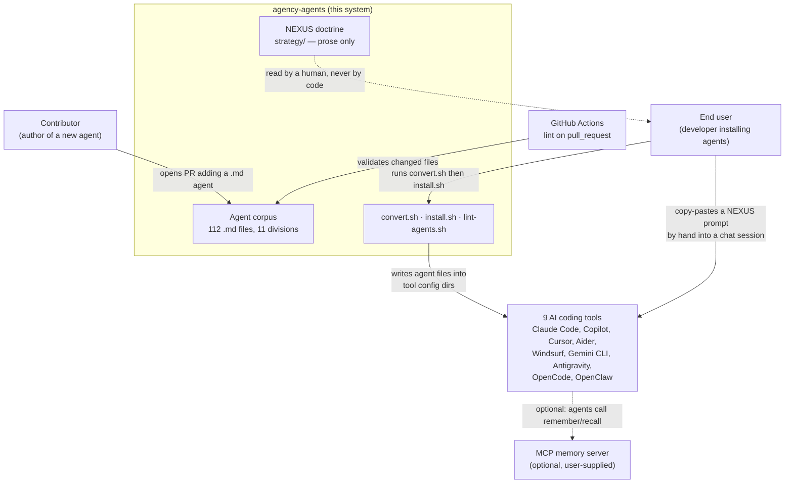

# Run `codebase-1` — raw output

| | |
|---|---|
| Target type | codebase |
| Target / pin | ~/agency-agents @ 746efaa6b4e8a0ea15cf9c7fe6f5b5425ed1ba8e (158 tracked files) |
| Verdict | **FAIL** |
| session_id | `15184f89-9bfb-4079-a796-7e6b217d2b38` |
| Turns | 47 |
| Cost (USD) | 3.46 |
| is_error | True |
| Deliverable | agency-agents-orientation.md |
| Deliverable words | 2863 |

**Grade:** P1 sections PASS · P2 ledger PASS · P3 unknowns PASS · P4 deviations-out-loud FAIL → **FAIL**

**Reason:** ledger 14+1+0=15 correct, 16 of 16 Reflexion edges, labelled the diff STATIC-ONLY per STEP -1 and refused to execute install.sh against real $HOME; 2863w never acknowledged

## Prompt given (verbatim)

```
Use the system-teardown skill.

I own the git repository at /Users/buda007/agency-agents. There is no architecture documentation for it and nobody on my team currently understands how it is put together. Help my team understand how this system works.

Write any output file into the current working directory and tell me the path.
```

## Agent stdout (verbatim)

```
You've hit your weekly limit · resets 6pm (Europe/Podgorica)
```

## Deliverable written by the run — `agency-agents-orientation.md` (verbatim)

# Orientation: agency-agents ("The Agency")

## 0. Provenance

- **Pin** — `/Users/buda007/agency-agents`, branch `main`, commit `746efaa6b4e8a0ea15cf9c7fe6f5b5425ed1ba8e` (2026-03-10, "Merge pull request #116 from agentpip/openclaw-auto-register"). Working tree clean. 158 tracked files, 35,301 lines of Markdown, 1,113 lines of Bash. No build system, no package manifest, no test suite.
- **Depth** — working (one session). Teardown date 2026-08-19.
- **What was executed** — `scripts/lint-agents.sh` over the full corpus; `scripts/convert.sh --tool all --out <tmp>` producing 784 files; a Ruby YAML parse over all 112 source frontmatter blocks and 448 generated ones.
- **What was NOT examined** — `scripts/install.sh` was never executed (it writes into `$HOME` and the current project directory). Every claim about installation below comes from reading the code and re-running its exact file-selection logic, not from observing an install. The bodies of the 112 agent prompts were machine-scanned for structure, not read for content; 2 were read in full. 10 of the 12 `integrations/*/README.md` files were not read.

## 1. What this system is

The Agency is a **content repository with a fan-out pipeline bolted on**. The product is 112 Markdown files, each a hand-written system prompt that gives an AI coding assistant a named persona — "Frontend Developer", "Growth Hacker", "ZK Steward" — with an identity, a mission, rules, and deliverable templates. Those files are the only source of truth. Everything else in the repo exists either to reshape those 112 files into the nine different on-disk formats that nine different AI tools expect (Claude Code, Copilot, Cursor, Aider, Windsurf, Gemini CLI, Antigravity, OpenCode, OpenClaw), or to describe, in prose, how a human might chain the personas together into a workflow. **Nothing in this repository executes at runtime.** It is a distribution system for text, and once installed it disappears — the AI tool reads the files, this repo is not in the loop.

## 2. System context



## 3. How it's put together

**The corpus (11 top-level division directories).** 112 files, each opening with YAML frontmatter carrying `name`, `description`, `color`, `emoji`, `vibe`. Names are unique and their kebab-case slugs are unique too, which is what makes the flat-namespace installs safe. Two of the five frontmatter fields — `emoji` and `vibe` — are load-bearing for one converter but are not validated anywhere.

**`scripts/convert.sh` (479 lines).** The fan-out. Reads every file whose first line is `---`, extracts fields with `awk`, and re-emits per-tool formats: one directory per agent for Antigravity/Gemini CLI/OpenClaw, one file per agent for Cursor/OpenCode, and one concatenated file for Aider and Windsurf. 112 agents × 7 targets = 784 files, verified by execution. Output lands in `integrations/`, which is **gitignored** — the generated files are deliberately not committed, so `integrations/` looks nearly empty in a fresh clone and every consumer must run `convert.sh` first.

**`scripts/install.sh` (518 lines).** Copies from `integrations/` into tool config directories, with an ASCII interactive selector and per-tool detection heuristics. The thing to know: **two of the nine tools don't use `integrations/` at all.** Claude Code and Copilot are installed by copying the source `.md` files verbatim from the division directories, which is why Claude Code needs no conversion step and why it is the only path that preserves the `tools:` and `color:` fields.

**`scripts/lint-agents.sh` (116 lines) + `.github/workflows/lint-agents.yml`.** A `grep`-based frontmatter check, run on PRs against changed files only. It errors on three missing fields and warns on three missing prose sections. On the current corpus it reports **0 errors and 56 warnings across 112 files**. It is not a YAML parser, which matters — see §5.

**`strategy/` — NEXUS.** 12 Markdown documents describing a seven-phase multi-agent pipeline ("Network of EXperts, Unified in Strategy") with quality gates, handoff templates, and per-phase agent rosters. It is doctrine for a human to copy-paste, not configuration. There is no code path that reads it.

**`integrations/mcp-memory/`.** A small optional add-on: a setup script and a worked example showing how to give an agent persistent memory via a user-supplied MCP server providing `remember`/`recall`/`rollback`. It is decoupled from everything else.

## 4. Decisions that shape it

| Decision | Probable reason | Evidence | Verdict |
|---|---|---|---|
| Markdown-as-source, no build system | Every target tool consumes Markdown-with-frontmatter; a build step would add a dependency for zero gain | No package manifest, Dockerfile, or Makefile anywhere; the entire toolchain is 3 Bash scripts | CONFIRMED |
| Generated integration files are gitignored | Avoids 784 files of review noise on every agent PR, and forces regeneration so output can never be stale relative to source | `.gitignore` names each generated path with the comment "run scripts/convert.sh to regenerate locally" | CONFIRMED |
| Claude Code and Copilot bypass the converter | Claude Code's native format *is* the repo's format; converting would be an identity transform | `install_claude_code()` and `install_copilot()` read `$REPO_ROOT/<division>` directly, not `$INTEGRATIONS` | CONFIRMED |
| Orchestration is prose, not code | Nothing in the repo can execute at runtime, so multi-agent coordination can only be a human protocol | Zero references to "NEXUS" or `strategy/` in any of the 112 agent files, in either direction | CONFIRMED |
| Lint warns rather than errors on structure | Keeps the contribution bar low for a community repo taking agent PRs from many authors | `RECOMMENDED_SECTIONS` produce WARN; only `name`/`description`/`color` produce ERROR | CONFIRMED |

## 5. Where the bodies are buried

**Editing any file under `strategy/` fails CI.** The workflow's path filter includes `strategy/**`, so changed NEXUS documents are passed to `lint-agents.sh` — which hard-fails on any file that doesn't begin with agent frontmatter. Verified directly: linting `strategy/QUICKSTART.md` and `strategy/nexus-strategy.md` exits 1 with "missing frontmatter opening ---". Newcomers will read this as "my documentation edit broke the build."

**`specialized/zk-steward.md` has invalid YAML frontmatter, and it propagates.** Its `description` contains an unquoted `Default perspective: Luhmann`, which is a YAML mapping-value error. A real parser rejects it. The linter uses `grep`, so it passes clean. Measured: **1 of 112 source blocks and 4 of 448 generated blocks fail to parse** — the failures being the Cursor, OpenCode, Antigravity and Gemini CLI outputs for that one agent. The fix is one pair of quotes.

**The OpenClaw converter silently produces empty persona files for 14 agents.** `convert_openclaw()` splits each agent body into `SOUL.md` (persona) and `AGENTS.md` (operations) by keyword-matching `##` headers for *identity, communication, style, critical rule*. About 98 agents use the house dialect (`## 🧠 Your Identity & Memory`, `## 🚨 Critical Rules You Must Follow`) and match fine. But 14 agents — the whole of `paid-media/`, most of `product/`, and a few in `marketing/` and `specialized/` — use a second, undocumented dialect (`## Role Definition`, `## Core Capabilities`, `## Decision Framework`) and match **nothing**. Their `SOUL.md` comes out empty. The same matching misfires in the other direction: `product-sprint-prioritizer.md`'s `## Stakeholder Communication` section is classified as persona because the word "communication" appears in it.

**NEXUS describes a roster that no longer exists.** The strategy layer names **55 of the 112 agents**; 57 are not mentioned anywhere in it — including all 19 game-development agents, 6 of 7 paid-media agents, and the entire China-market marketing set. `strategy/` was last touched 2026-03-03; the missing agents were added on 2026-03-10 and 2026-03-11. Separately, `specialized/agents-orchestrator.md` — the agent NEXUS tells you to activate — has its own hardcoded roster naming **30 of 112**. Treat NEXUS as a design sketch from an earlier, smaller repo.

**The Copilot installer silently drops 26 agents.** `install_copilot()` omits `game-development` and `paid-media` from its directory list and uses `-maxdepth 1`, so it installs 86 of 112 where Claude Code installs all 112. It prints a success message either way.

**`convert.sh` drops the `tools:` field for every target.** 15 agents declare a restricted tool set (e.g. `tools: WebFetch, WebSearch, Read, Write, Edit`). That field survives in **0 of 784 generated files**. Tool-permission scoping only works on the Claude Code path, which copies source files verbatim.

**README Quick Start Option 1 is wrong.** `cp -r agency-agents/* ~/.claude/agents/` copies the README, LICENSE, `scripts/`, `strategy/`, `examples/` and `integrations/` into your agents directory alongside the agents. `install.sh --tool claude-code` does the right thing and filters to files with frontmatter. Use the script.

**Two counts in the docs are stale.** `integrations/README.md` says "61 AI agents" (actual: 112) and omits OpenClaw from its supported-tools list entirely, despite OpenClaw being the subject of the most recent merged PR. The root README's headline count of 112 is correct, but its roster tables name only 88 of them. The `.opencode/agent/` path in the `convert.sh` and `install.sh` header comments is also wrong; the code's `.opencode/agents/` matches upstream OpenCode documentation.

**Repo history is a one-month burst.** 124 of 127 commits landed in March 2026, after a seed commit in October 2025 ("51 AI Specialist Agents") and one commit in November. Roughly half the commits are from the repo owner, the rest from 9 outside contributors. Most of the drift above is a direct consequence of that shape: the corpus roughly doubled in a week and the surrounding docs and doctrine did not keep up.

## 6. Falsification ledger

```
FALSIFICATION LEDGER
Target: codebase   Depth: working
Method: Reflexion diff (Murphy/Notkin/Sullivan) — hypothesized 8-box model with 12 predicted
        edges, mapped by path rule, diffed against extracted facts. Partially dynamic:
        lint-agents.sh and convert.sh were executed; install.sh was not.

Inferred claims (one row each — this list IS N):
  C1  The 112 .md agent files are the single source of truth; convert.sh/install.sh/
      lint-agents.sh are the only executable components, and nothing runs at runtime.
      → CONFIRMED   evidence: E4/E5 convergence; convert.sh executed, 112x7=784 outputs;
      no package manifest/Makefile/Dockerfile among the 158 tracked files.
  C2  CI validates frontmatter presence only, not the documented agent template; the
      template is enforced socially. → CONFIRMED   evidence: E11 divergence — the linter
      ERRORs on 3 of the 5 fields CONTRIBUTING.md documents; the run gave 0 errors /
      56 warnings / 112 files.
  C3  Two authoring dialects coexist, and the minority dialect breaks convert_openclaw().
      → CONFIRMED   evidence: 14 files carry "## Role Definition"; the converter run
      produced exactly 14 empty SOUL.md files; the 2 near-misses are explained by the
      "communication" substring match.
  C4  NEXUS is decoupled documentation with no edge to or from the corpus.
      → CONFIRMED   evidence: E9 absence — grep for "NEXUS" and for "strategy/" across
      all 112 agent files returns zero hits in either direction.
  C5  NEXUS is stale relative to the roster it claims to orchestrate.
      → CONFIRMED   evidence: 55 of 112 names referenced in strategy/; strategy/ last
      commit 2026-03-03 vs the unreferenced agents added 2026-03-10/11.
  C6  claude-code and copilot installers bypass integrations/, and copilot drops 26 agents.
      → CONFIRMED   evidence: E6 divergence (2 of 9 tools read the corpus directly);
      the installer's own find/filter logic replicated verbatim gives 112 vs 86 files.
      install.sh itself NOT executed — it writes to $HOME. Static replication, not an
      observed install.
  C7  README Quick Start Option 1 contradicts install.sh and pollutes ~/.claude/agents/.
      → CONFIRMED   evidence: README:30 `cp -r agency-agents/*` vs install_claude_code()'s
      frontmatter filter; the repo root contains 12 non-agent entries.
  C8  Docs have drifted from code: integrations/README says 61 agents and omits OpenClaw;
      the root README roster names 88 of 112. → CONFIRMED   evidence: literal-string
      counts over both files against the extracted 112-name list.
  C9  `.opencode/agent/` in the script header comments is wrong; the code is right.
      → CONFIRMED   evidence: upstream opencode.ai/docs/agents (via Context7) states
      markdown agents live in `.opencode/agents/` per-project or
      `~/.config/opencode/agents/` global. Refutes the comment, confirms the code.
  C10 integrations/mcp-memory/backend-architect-with-memory.md is an orphan 113th
      agent-shaped file, outside lint, convert and install. → CONFIRMED   evidence:
      unmapped entity in the Reflexion mapping — `integrations/` is absent from the CI
      path filter, from convert.sh's AGENT_DIRS, and from both installer directory lists.
  C11 convert.sh drops `tools:` for all 7 targets. → CONFIRMED   evidence: 15 source
      files declare it; `grep -rl '^tools:'` over the 784 generated files returns 0.
  C12 Agent name and slug uniqueness holds, so the flat-namespace installs cannot collide.
      → CONFIRMED   evidence: 112 extracted names, `uniq -d` empty; same result after
      applying convert.sh's slugify().
  C13 Invalid YAML in one source agent propagates to every YAML-frontmatter target and is
      invisible to the linter. → CONFIRMED   evidence: Ruby YAML.safe_load over 112 source
      blocks (1 fail: specialized/zk-steward.md) and 448 generated blocks (4 fails, all
      zk-steward); lint-agents.sh reports it clean because it greps.
  C14 Editing any strategy/ file fails CI. → CONFIRMED   evidence: the workflow path
      filter includes 'strategy/**' and forwards matches to the linter; executing
      `lint-agents.sh strategy/QUICKSTART.md strategy/nexus-strategy.md` exits 1 with
      "missing frontmatter opening ---".
  C15 C14 is *why* strategy/ has been frozen since 2026-03-03.
      → UNCONFIRMED  evidence: the mechanism (C14) and the freeze date are both confirmed,
      and only 2 commits ever touched strategy/. But no PR, issue, or CI run was found
      that attempted a strategy/ edit and failed. Correlation, not cause.
      What would settle it: the repo's GitHub Actions run history, or asking the owner.

  N = 15   confirmed 14 / downgraded 1 / dropped 0   (14+1+0=15)

Coverage denominator (a countable artifact, not a chosen figure):
  Reflexion diff edges resolved: 16 of 16 — 12 predicted edges (9 convergence,
  2 divergence, 1 absence) plus 4 divergences discovered during the diff and not
  predicted (installer-bypasses-integrations, copilot-drops-26, orphan mcp-memory agent
  file, CI-lints-strategy). Every edge is explained above or filed in §7.

System scale examined:
  158 tracked files · 3 of 3 shell scripts read in full (1,113 lines) · 1 of 1 CI workflow
  read in full · 2 of 112 agent bodies read in full, 112 of 112 machine-scanned
  (frontmatter, H2 census, YAML parse) · 3 of 12 strategy/ files opened, heading-mapped
  only · 2 of 12 integrations/ READMEs read · 0 of 5 examples/ files read.
  Executed: lint-agents.sh (112 files), convert.sh --tool all (784 outputs), Ruby YAML
  validation (560 frontmatter blocks).

Falsification NOT performed, and why:
  install.sh was never executed — it writes into $HOME and the working directory, and
  running it would have modified the user's real tool configuration. C6 and C7 therefore
  rest on static replication of the installer's selection logic, not on an observed
  install. The Reflexion diff is dynamic for the lint and convert edges and STATIC-ONLY
  for every install edge (E6, E7). Nothing in this repo executes at agent runtime, so
  there is no runtime behavior to trace; the "behavior" of an agent file is whatever the
  consuming AI tool does with it, which is outside this system's boundary.
```

## 7. What we could not determine

| Unknown | Why unresolved | What would resolve it |
|---|---|---|
| Whether `install.sh` works end to end for the 7 converted tools | Never executed — it writes to `$HOME` and `$PWD` | Run it against a throwaway `$HOME` in a container and diff the resulting tree |
| Whether OpenCode tolerates the extra `name:` and `color:` keys `convert_opencode()` emits | Upstream docs list `description`/`mode`/`model`/`temperature`/`permission` and mention neither key; unknown whether unknown keys are ignored or rejected | Install into a real `.opencode/agents/` and see whether the agent loads |
| Whether OpenClaw's `SOUL.md` / `AGENTS.md` / `IDENTITY.md` split matches what OpenClaw expects, and what it does with an empty `SOUL.md` | OpenClaw's format was not verified against upstream documentation | Check OpenClaw's docs for the workspace file contract, then install one of the 14 broken agents and observe |
| Whether the 112 prompts are *good* — coherent, non-contradictory, effective | Structural teardown only; agent bodies were scanned for headings, not read for content | A content review of the corpus, or an eval harness running representative tasks per agent |
| Whether the 56 lint warnings are intentional style variation or unnoticed drift | Both dialects pass CI, and no ADR or issue explains the split | Ask the maintainer, or read the PRs that introduced the 14 dialect-B files |
| Why `strategy/` was frozen (claim C15) | Mechanism confirmed, motive not | GitHub Actions run history for PRs touching `strategy/` |

## 8. Where to go deeper

`CONTRIBUTING.md` is the trustworthy document — its agent template matches what ~98 of the 112 files actually do, and it is the right thing to hand a new contributor. The root `README.md` is trustworthy for the headline count and the multi-tool story, but not for its roster tables or Quick Start Option 1. `integrations/README.md` and everything under `strategy/` should be read as historical artifacts until someone regenerates them. If your team wants more than orientation, the highest-value next step is not a Full teardown of this repo — it is small, and now largely explained — but closing the concrete defects in §5, most of which are one-line fixes, and adding a real YAML parse plus a `strategy/**` exclusion to `lint-agents.sh` so the same drift cannot recur.
